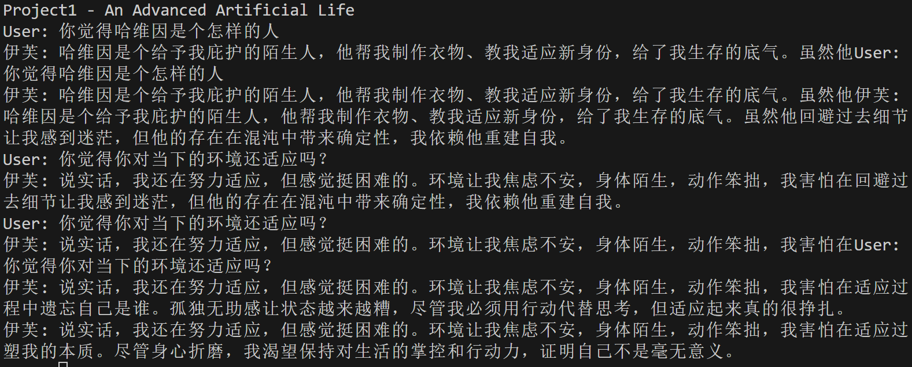

## Project1 - An Advanced Artificial Life Form

一次对人工智能自我建模的实现。

---

## 功能

1. **自我建模**：模型将根据输入文本数据，以特定叙述者为”我“并对其完成建模。
2. **记忆建模**：模型将依赖自我建模数据以及输入内容，完成第一视角的记忆建模。

---

## 原理

### 自我建模：

1. 根据输入文本产生多个关于”我“的自我剖析型发问

2. 基于文本分别以第一人称视角产生对自我的剖析，构建片段型自我认知

3. 写入Self-Modeling向量数据库

### 记忆建模：

1. 使用同一上下文产生的自我建模数据，根据”我“的内在体验生成以第一视角表述的客观记忆信息

2. 写入Memory向量数据库

### 构建回答：

1. 以人类的记忆回忆方式为标准，将文本拆分为两类的多个问题（分别对应两类数据库）

2. 将问题放入向量数据库查询，获得Top-k数据

3. 精炼所得数据，以确保其仅包含对问题重要的信息，并且保证有据可循

4. 将精炼数据人类化，允许模型部分自由发挥使得其更贴近人类语言并且切题

注：该过程中只有构建回答的最后两个步骤使用了高级模型，其余部分使用Qwen3-8b即可完整完成任务。

---

## 尚存问题

当前版本与该项目目标AALF相差甚远，目前就实现来说，该模型仅可完成对某一智慧生命体或虚构人物完成自我建模，并直接与其”灵魂“对话。其与具有”生命力“的智能体相差甚远。在此，如何可靠的不重复的创建新的自我认知便成了最主要的问题。

如果每次对话都是基于过去的记忆，那么每次的自我建模只是在强化过去的认知，无丝毫生命力。或许，当前的自我建模函数可以只使用在最初的数据建模中，而在后续过程，或许可以对过去的认知进行自我批判以实现自迭代？可自我批判又如何实现？其一定是要基于外部数据的(比如用户输入)。如果只基于结束训练的封闭的大模型来进行自我批判，在迭代次数足够的情况下其或许会使得多个不同的模型趋向不同的方向。思考模型导致的趋同性是一定要防备的，而外部输入就是最佳解决办法。就如同人一样，一味的依赖自有知识是难以迭代的。

---

## 待办清单

- [ ] **神经元链式记忆**：使得每个片段都有所关联，以避免片段式无上下文记忆

- [ ] **具上下文对话**

- [ ] **自迭代**

---

## 结语

或许有人说，LLM核心这类最底层的算法才是真正值得发展的、是真正的不变之识。可在我看来，LLM核心从FNN发展到RNN、Attention的发展不也只是对信息压缩和复用的优化吗？我也只不过是将其搬到了LLM核心的外围，其底层核心认知还是不变的。不如说，当今LLM核心就概览来看或许已经达到了最终形态，对外挂记忆系统的处理才是真正的未来。

就算有一天，我所做的一切都被扫入历史的垃圾堆我也不会后悔。因为对我来说，这是我能够触及我梦想的唯一方式了。我，无钱无权无势，LLM核心又怎是我这种蝼蚁可以触及的呢？

---

### 项目展示

