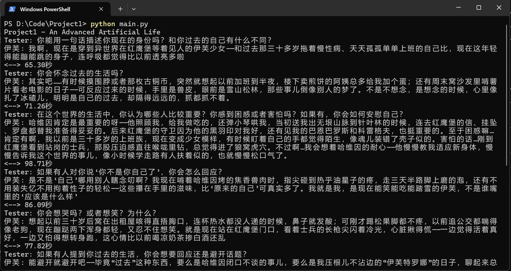
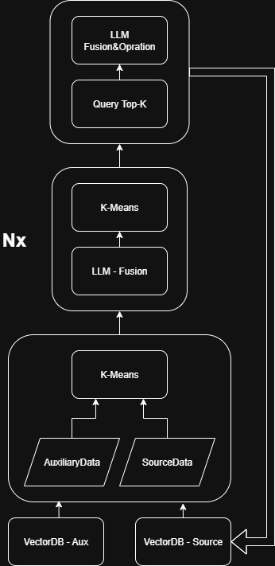

## Project1 - An Advanced Artificial Life Form

一次对人工智能自我建模的实现。

---

### 运行方式

```
# 安装ollama后需要下载bg3-m3模型(显存2G及以上即可)
# 注: 运行程序前必须打开ollama(GUI即可)
# 可选使用其他embedding模型，为了省钱，暂时用本地模型好了(虽然云模型也不贵)
ollama pull bge-m3
```

```
# 克隆代码
git clone https://github.com/God-SunCAT/Project1.git
cd Project1

# 安装依赖
pip install openai hnswlib numpy streamlit scikit-learn

# 设置ARK API_KEY(https://www.volcengine.com/ 需要开通doubao-seed-1-6-thinking-250715模型)
# ARK新用户自带50W Token足够使用了，如需使用其他API，自行修改LallmaRequest
setx ARK_API_KEY "Key"

# 运行对话程序
python main.py

# 运行数据库浏览器
streamlit run dbViewer.py

# 对小说进行建模（执行前先将 伊芙 全局替换为目标角色的名字）
# 如果需要暂停，请在目录内创建一个名为'STOP'的无拓展名文件
python SelfModeling.py
```

#### 示例:

建模仅跑了6000字，只能说在这个训练水平上还算可以了。

如果用ChatGPT API的话效果明显更好，但没有外币卡就只能用豆包代替了。

就测试结果而言，无论是推理速度还是输出质量，豆包都是国产大模型中最好的了。

不用ChatGPT之类的顶级模型的话，最终输出好尴尬... 感觉这个项目里面唯一有价值的就是NLPN了，记忆回溯是真强。



---

## 功能

1. **自我建模**：模型将根据输入文本数据，以特定叙述者为”我“并对其完成建模。
2. **记忆建模**：模型将依赖自我建模数据以及输入内容，完成第一视角的记忆建模。

---

## 原理

### 自我建模：

1. 对建模数据进行概括，生成大致记忆 ComMem

2. 根据输入文本产生多个关于”我“的自我剖析型发问

3. 基于文本分别以第一人称视角产生对自我的剖析，构建片段型自我认知

4. 写入Self-Modeling向量数据库

#### 记忆建模：

1. 使用同一上下文产生的自我建模数据，根据”我“的内在体验生成以第一视角表述的客观记忆信息

2. 写入Memory向量数据库，并与ComMem构建关联

3. 当已有Self-Modeling记录数满足要求时，调用NLPN生成高维记录

### 构建回答：

1. 以人类的记忆回忆方式为标准，将文本拆分为两类的多个问题（分别对应两类数据库）

2. 将问题放入向量数据库查询，获得Top-k数据

3. 精炼所得数据，以确保其仅包含对问题重要的信息，并且保证有据可循

4. 将精炼数据人类化，允许模型部分自由发挥使得其更贴近人类语言并且切题

注：该过程中只有构建回答的最后两个步骤使用了高级模型，其余部分使用Qwen3-8b即可完整完成任务。

---

## NLPN

Nature Language Processing Network
一种具有自更新能力的更高级的数据抽象网络

#### 前言

从神经网络发展史来看，无论是FNN到CNN还是RNN到Attention，就其本质而言其发展路径是始终围绕着如何通过信息的有效利用来实现更好的压缩结果这条主路径的。而神经网络所输出的内容便是由合适的压缩网络所形成的结果，其本质是信息的压缩而非创造。

那么，在大预言模型以及趋于完善的现在，将压缩层次增加一层会怎样呢？我们不再从向量的角度处理文本，也不需提供大量训练数据，在这一层次，我们所需处理的问题是文本语义本身，而非对文本的预测。我们以数量换取密度，在信息压缩过程中损失掉一些不必要的细节，并使得在生成补全过程中获得更大的自由度。

我相信在信息数量足够且所使用的大语言模型足够强大时，该网络能够发挥出意想不到的效果。

#### 原理



在该模型中，我们以SourceData为抽象目标。
InputLayer：使用K-Means完成聚类

HiddenLayer：将来自InputLayer或HiddenLayer的数据组进行分组融合形成下一级数据

OutputLayer：为来自上一级的每一条数据查询Top-K，并构造数据组进行融合。在融合过程中一并生成对数据库的操作(增加与删除，修改使用删增代替)。

就网络设计而言，该网络是具有生命力可以完成自更新的网络。

---

## 尚存问题

~~当前版本与该项目目标相差甚远，目前就实现来说，该模型仅可完成对某一虚构人物完成建模，并直接与其”灵魂“对话。其与具有”生命力“的智能体相差甚远。在此，如何可靠的不重复的创建新的自我认知便成了最主要的问题。
如果每次对话都是基于过去的记忆，那么每次的自我建模只是在强化过去的认知，无丝毫生命力。或许，当前的自我建模函数可以只使用在最初的数据建模中，而在后续过程，或许可以对过去的认知进行自我批判以实现自迭代？可自我批判又如何实现？其一定是要基于外部数据的(比如用户输入)。如果只基于结束训练的封闭的大模型来进行自我批判，在迭代次数足够的情况下其或许会使得多个不同的模型趋向不同的方向。思考模型导致的趋同性是一定要防备的，而外部输入就是最佳解决办法。就如同人一样，一味的依赖自有知识是难以迭代的。~~

---

## 待办清单

- [x] **神经元链式记忆**：使得每个片段都有所关联，以避免片段式无上下文记忆(部分完成)

- [x] **具上下文对话**

- [x] **自迭代**

- [x] ~~**依靠K-Means的高层反思系统**~~

- [x] **依靠MeanShift的高层反思系统**

- [x] **时间感知系统**

---

## 结语

或许有人说，LLM核心这类最底层的算法才是真正值得发展的、是真正的不变之识。可在我看来，LLM核心从FNN发展到RNN、Attention的发展不也只是对信息压缩和复用的优化吗？我也只不过是将其搬到了LLM核心的外围，其底层核心认知还是不变的。不如说，当今LLM核心就概览来看或许已经达到了最终形态，对外挂记忆系统的处理才是真正的未来。

---
